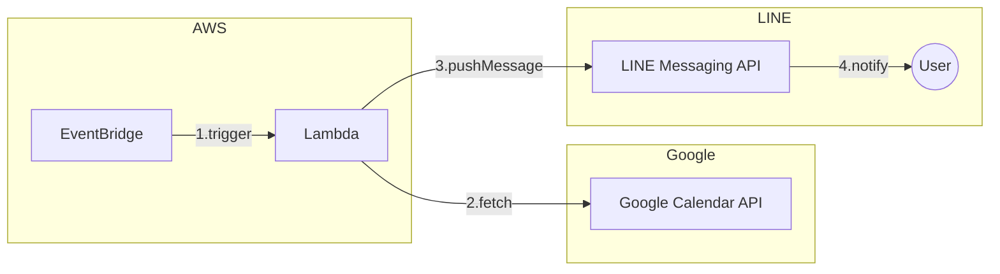
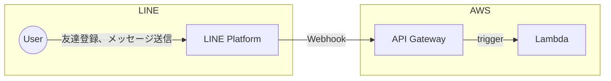

# schedule-line-reminder

[](https://deepwiki.com/yuma-ito-bd/schedule-line-reminder)

Googleカレンダーに登録している1週間分の予定をLINEに通知してくれるプロジェクトです。

※現在はLINEアカウントやAWSリソースを自分で用意する必要があります。

## 使い方

1. LINEアカウント「マイスケジュールリマインダー」を友達登録する。
2. GoogleアカウントでGoogleカレンダーへのアクセスを許可する。
3. 毎日21時に1週間分の予定がLINEに通知されます。

## できること

- 1対1のトークのみ対応
- デフォルトのGoogleカレンダーの予定を1週間分通知する

## 対応予定の機能

- グループトーク内での通知
- デフォルトカレンダー以外のカレンダーの予定を通知する
- 時間指定がない終日の予定の通知

# 開発方法

## 必要なツール

各種インストールしてください。

- Bun v1.1.34 以上
  - パッケージマネージャーやテストのランタイム環境として利用しています。
  - [`asdf`](https://asdf-vm.com/)でバージョン管理しているので、asdfもインストールしてください。
- AWS CLI v2.22.26 以上
  - 後述のAWS SAMを利用するために必要です。
  - 参考：[AWS CLI の最新バージョンのインストールまたは更新 - AWS Command Line Interface](https://docs.aws.amazon.com/ja_jp/cli/latest/userguide/getting-started-install.html)
- AWS SAM (AWS Serveless Application Model)
  - LambdaなどのAWSリソースを管理します。
  - 参考：[AWS SAM CLI のインストール - AWS Serverless Application Model](https://docs.aws.amazon.com/ja_jp/serverless-application-model/latest/developerguide/install-sam-cli.html)

### 利用しているAPI

- [LINE Messaging API](https://developers.line.biz/ja/docs/messaging-api/overview/)：LINEユーザーにメッセージを送信するためのAPI
- [Google Calendar API](https://developers.google.com/calendar/api/guides/overview?hl=ja)：Googleカレンダーの予定を取得するためのAPI

## システムフロー図

### カレンダーの予定を通知する
カレンダーの予定の通知は以下のように行っています。



1. EventBridgeによって毎日21時にLambdaがトリガーされます。
2. LambdaではGoogle Calendar APIからカレンダー情報を取得し、LINE Messaging APIに対してメッセージを送ります。
3. LINEユーザーにメッセージが届きます。

### LINEユーザーからのイベントを受け取る

LINEユーザーが友達登録した際、メッセージを送信した際は以下のようにイベントを取得できます。



1. LINEユーザーが友達登録やメッセージ送信などを行う
2. LINEプラットフォームから登録済みのWebhook用エンドポイントにリクエストが送られる
3. API GatewayからLambdaを起動する

## 環境構築

### 各サービスでの設定

- LINE
  - LINE公式アカウントを作成する
  - 参考：https://zenn.dev/link/comments/42fbfda5176305
- Google
  - Google Cloudプロジェクトを作成し、Google Calendar APIを利用できるようにする
  - Google CloudプロジェクトのクライアントID、クライアントシークレットを発行してください。
  - 参考：https://zenn.dev/link/comments/522cacc14e3d14

### 各種トークンの発行
以下のアクセストークンが必要になるため、発行します。

- LINE Messaging APIのための[チャネルアクセストークン](https://developers.line.biz/ja/docs/messaging-api/generate-json-web-token/)
  - 発行方法：https://zenn.dev/link/comments/ecfe0a7ca1d312

### デプロイ

下記のコマンドを実行するとAWS環境にリソースが作成されます。

```bash
bun run build
bun run deploy
```

その後、AWS SSMのパラメータストアまたはLambdaの環境変数に以下の値を設定してください。

パラメータ名 | 環境変数名 | 説明
---|---|---
line-schedule-reminder-google-client-id | GOOGLE_CLIENT_ID | Google Calendar APIのためのクライアントID
line-schedule-reminder-google-client-secret | GOOGLE_CLIENT_SECRET | Google Calendar APIのためのクライアントシークレット 
line-schedule-reminder-google-redirect-uri | GOOGLE_REDIRECT_URI | Googleで認可を得たときにリダイレクトされるURL
line-schedule-reminder-line-channel-access-token | LINE_CHANNEL_ACCESS_TOKEN | LINEチャネルアクセストークン
line-schedule-reminder-line-channel-secret | LINE_CHANNEL_SECRET | LINEチャネルの署名キー

### 動作検証

AWSマネジメントコンソールからデプロイしたLambdaをテスト起動してください。
（参考：[コンソールでの Lambda 関数のテスト - AWS Lambda](https://docs.aws.amazon.com/ja_jp/lambda/latest/dg/testing-functions.html)）

正しく設定できていれば公式アカウントからGoogleカレンダーの予定が通知されます。

## ユニットテスト

ユニットテストは`__tests__`フォルダに格納しています。下記のコマンドで実行してください。

```bash
bun run test
```

## LICENSE

MITライセンスです。
